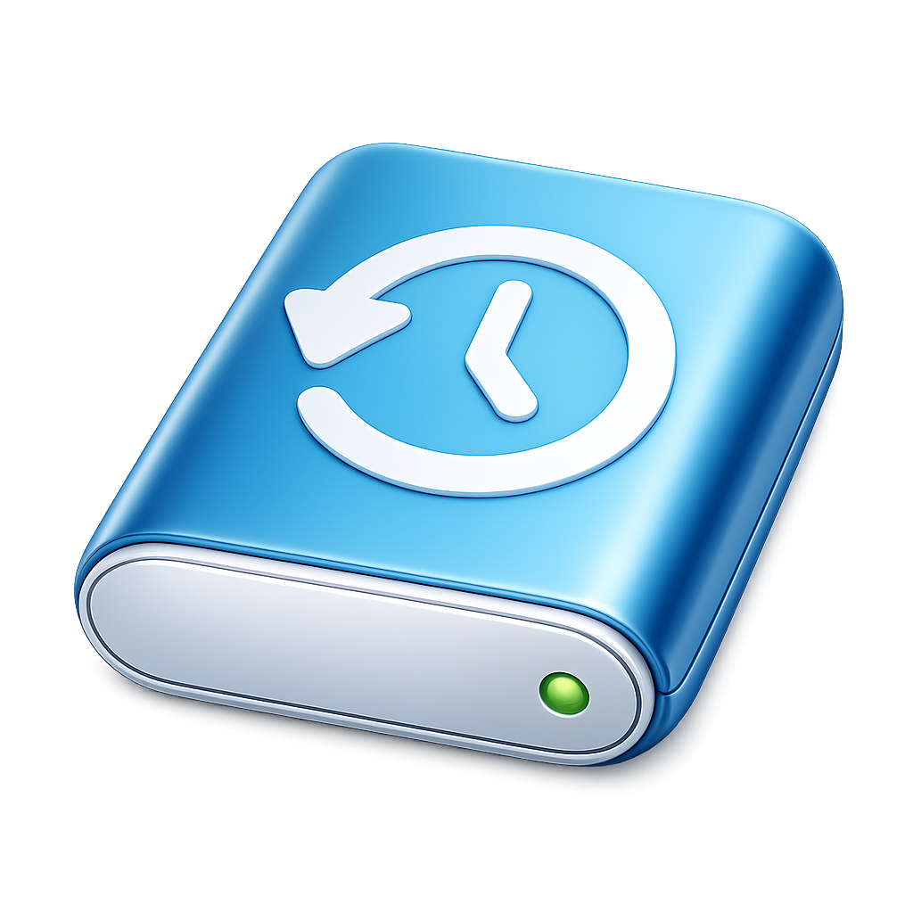

<p align="center">
  
</p>

<h1 align="center">macback</h1>

<p align="center"><strong>Interactive macOS backup and restore CLI</strong></p>

<p align="center">
  <a href="LICENSE"></a>
  <a href="https://github.com/gastonmorixe/macback/actions/workflows/ci.yml"></a>
  <a href="https://www.shellcheck.net/"></a>
  <a href="https://www.apple.com/macos/"></a>
</p>

---

**macback** backs up and restores your entire macOS environment: files, configs, Homebrew packages, system metadata, and more. It runs in an **interactive terminal UI** with smart defaults that exclude caches, build artifacts, and iCloud clutter automatically. Built entirely in Bash, powered by [rclone](https://rclone.org/).

## ✨ Features

- 🎛️ **Interactive TUI**: arrow keys, vim bindings (`j`/`k`), `/` filtering, and `Space` multi-select
- 📦 **Modular components**: back up files, Homebrew, keychain metadata, launchd metadata, and system snapshots independently
- 🧠 **Smart defaults**: iCloud paths, caches, `node_modules`, build artifacts, and other rebuildables are excluded automatically
- 🔄 **rclone-powered**: reliable file transfer with progress reporting and integrity verification
- 🔒 **SHA256 checksums**: `rclone check` verifies that backups are complete and correct
- 📋 **JSON manifests**: spec versioning for structured metadata and forward compatibility
- ⏸️ **Resume support**: pick up interrupted backups without re-copying transferred files
- 🎯 **Granular restore**: choose which components, paths, and individual app configs to restore
- 🏥 **Doctor command**: diagnose and fix backup health, permissions, and integrity issues
- 🧪 **Comprehensive tests**: 22 test files (unit + integration + PTY) powered by BATS
- 🔐 **Runs as root**: full access to system files and Library data, with automatic user detection

## 📦 What Gets Backed Up

| Component | Contents |
|---|---|
| **Files** | Projects, Documents, Desktop, Downloads, SSH keys, GPG keys, shell configs, dotfiles, Library preferences, Mail, Messages, LaunchAgents |
| **Homebrew** | Brewfile, formula/cask lists, taps, leaves, services. Everything needed to reconstruct your dev environment |
| **Keychain metadata** | Keychain discovery and locations (metadata only, no secrets exported) |
| **Launchd metadata** | User LaunchAgents and custom system LaunchDaemons/LaunchAgents |
| **System snapshot** | macOS version, machine serial, hostname, full application inventory |

## 🚫 What Gets Excluded

macback skips things you can rebuild:

- ☁️ **iCloud**: Mobile Documents, CloudStorage, iCloud app support
- 🗑️ **System caches**: `.DS_Store`, Library Caches/Logs/WebKit, Xcode DerivedData
- 📦 **Package caches**: `node_modules`, `.pnpm-store`, `.yarn/cache`, `.bun/install/cache`
- 🔨 **Build artifacts**: `__pycache__`, `.pytest_cache`, `.gradle`, `target/`, `.terraform`
- 🔌 **Socket files**: `.gnupg/S.*`, `*.sock`, agent sockets

All defaults are customizable through the **interactive rules editor** during backup.

## 📋 Requirements

- **macOS** (tested on macOS 13+)
- **Bash 4+** (ships with macOS or install via Homebrew)
- **[rclone](https://rclone.org/)**: `brew install rclone`
- **Homebrew** (optional, only needed for the Homebrew component)

## 🚀 Installation

```bash
git clone https://github.com/gastonmorixe/macback.git
cd macback
make bootstrap   # checks for shellcheck and bats-core
```

## 📖 Usage

### Interactive mode

```bash
sudo bash ./macback
```

Opens the TUI main menu:

```
macback
macOS backup and restore

  Mode              Interactive
  Primary user      youruser
  Primary home      /Users/youruser

  ❯ Backup          Create a new backup run
    Restore         Restore from an existing backup
    Inspect         View backup metadata and verification state
    Doctor          Check and fix backup health and permissions
    Help            Usage information
    Quit            Exit the tool
```

### Direct commands

```bash
sudo bash ./macback backup     # guided backup flow
sudo bash ./macback restore    # guided restore flow
sudo bash ./macback inspect    # inspect an existing backup
sudo bash ./macback doctor     # check and fix backup health
sudo bash ./macback help       # show usage information
```

## ⌨️ TUI Controls

| Key | Action |
|-----|--------|
| `↑` / `k` | Move up |
| `↓` / `j` | Move down |
| `Enter` | Select / Confirm |
| `Space` | Toggle selection (multi-select) |
| `a` | Select all visible |
| `u` | Unselect all visible |
| `/` | Filter / Search |
| `q` | Cancel / Back |

## 🏗️ Architecture

```
macback              # main entrypoint
lib/
  common.sh          # environment detection, utilities, manifest discovery
  ui.sh              # terminal UI framework (colors, selectors, widgets)
  templates.sh       # backup rule template expansion (@HOME@ tokens)
  filter.sh          # rclone filter generation
  destination.sh     # destination volume selection and validation
  manifest.sh        # manifest creation, validation, integrity checks
  components.sh      # backup component handlers (files, brew, keychain, launchd, system)
  restore.sh         # restore workflows, path remapping, permission reconciliation
templates/
  include-paths.txt.template      # default paths to back up
  exclude-patterns.txt.template   # default exclusion patterns
```

Backups are stored on the destination volume under `macback/<machine-id>/<timestamp>/`:

```
meta/
  run.json              # run metadata (timestamps, source info, versions)
  manifest.json         # component flags and restore defaults
  include-paths.txt     # resolved include rules
  exclude-patterns.txt  # resolved exclude patterns
  integrity/            # SHA256 checksums and rclone verification results
components/
  files/rootfs/         # filesystem backup (mirrored directory tree)
  brew/                 # Brewfile, formula/cask lists, taps
  system/               # system facts, app inventory
  keychain/             # keychain metadata
  launchd/              # launchd plist inventory
```

## 🧑‍💻 Development

```bash
make bootstrap   # check dev dependencies (shellcheck, bats-core)
make lint        # run shellcheck on all scripts
make test        # run full BATS test suite (unit + integration)
make check       # lint + test
```

## 📄 License

[MIT](LICENSE). [Gaston Morixe](https://gastonmorixe.com/) 2026
